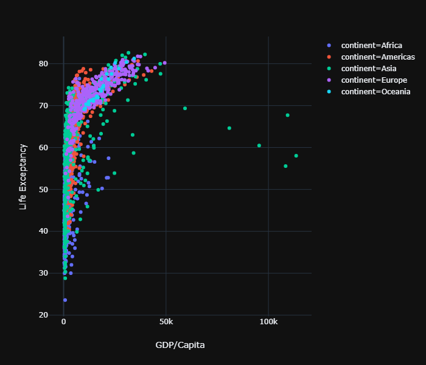
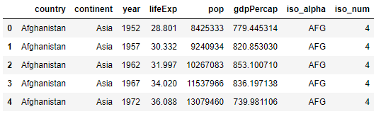
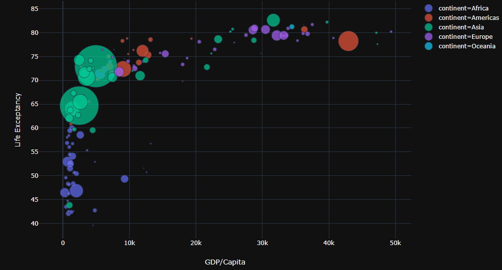
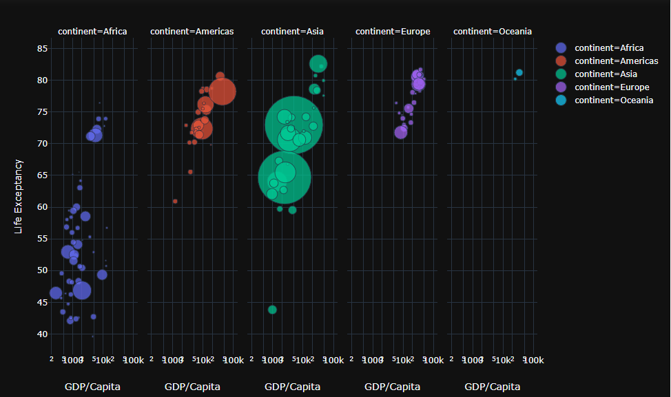
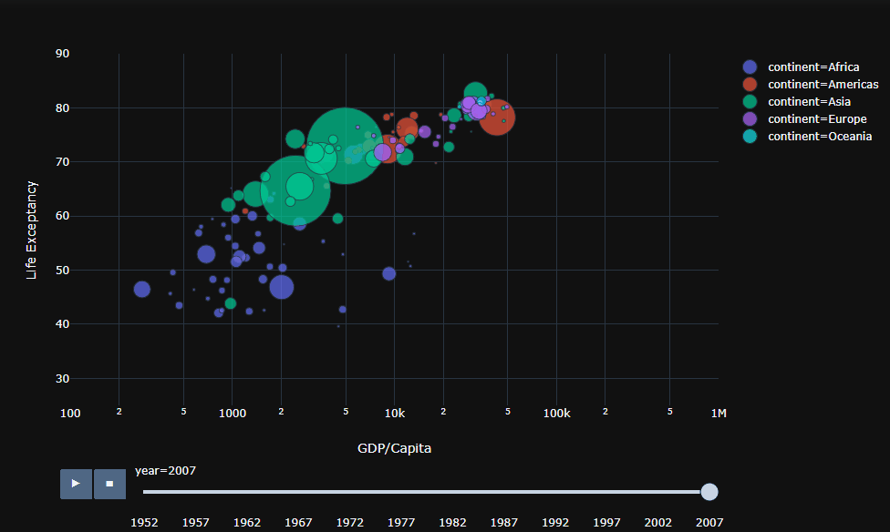

# :sparkles:	"Less code, Efficient & time saver" do more interactive Data Visualization with Plotly Express (python lib).

:hand: Wow! finally I found this `plotly_express` a new interactive python lib from plotly, so far this is one of the best Data visualization lib I have ever used in python. I liked the way it makes Dark template, interactive labels.

```python
import plotly_express as px
import matplotlib.pyplot as plt
%matplotlib inline
gapminder = px.data.gapminder()
#gapminder2007 = gapminder.query("year == 2007")

pd = px.scatter(gapminder, x="gdpPercap", y="lifeExp",template='plotly_dark',color='continent',labels = dict(lifeExp='Life Exceptancy',gdpPercap = 'GDP/Capita'))

```

```python 
gapminder.head()
```

```python

gap2007 = gapminder.query('year == 2007')
px.scatter(gap2007, x="gdpPercap", y="lifeExp",template='plotly_dark',color='continent',hover_name='country',size='pop',size_max=60,labels = dict(lifeExp='Life Exceptancy',gdpPercap = 'GDP/Capita'))

```
>In a single line by just writing `hover_name`,`size` and `labels` we can interactively show the visualization on python.




> We can facet the plot to pick apart the continents just by `facet_col = "continent"` and lets make the x-axis as logarithmic to visualize it more clearly

```python
px.scatter(gap2007, x="gdpPercap", y="lifeExp",template='plotly_dark',facet_col = "continent", log_x= True,color='continent',hover_name='country',size='pop',size_max=60,labels = dict(lifeExp='Life Exceptancy',gdpPercap = 'GDP/Capita'))
```


Now lets make some animation in plotly_express and how handy it is just by adding the `animation_frame= "year"` and `animation_group ="country"`. Why don't put some manual bounds such as `range_x = [100,1000000]` and `range_y = [25,90]`. :relaxed:

```python
px.scatter(gapminder, x="gdpPercap", y="lifeExp",template='plotly_dark', log_x= True,color='continent',animation_frame= "year",animation_group ="country",hover_name='country', range_x = [100,1000000], range_y = [25,90] ,size='pop',size_max=60,labels = dict(lifeExp='Life Exceptancy',gdpPercap = 'GDP/Capita'))

```


